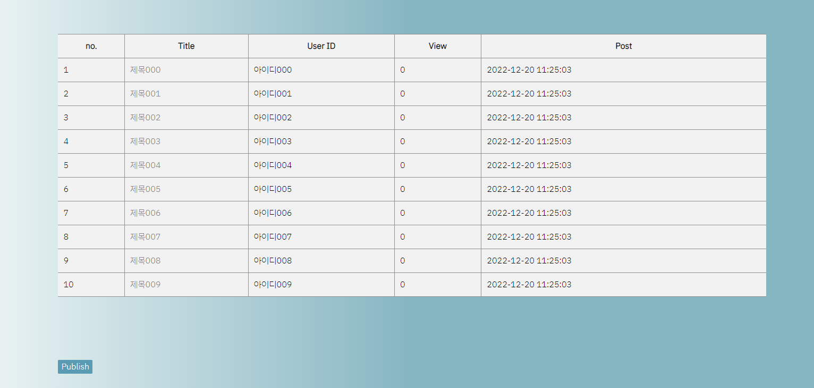
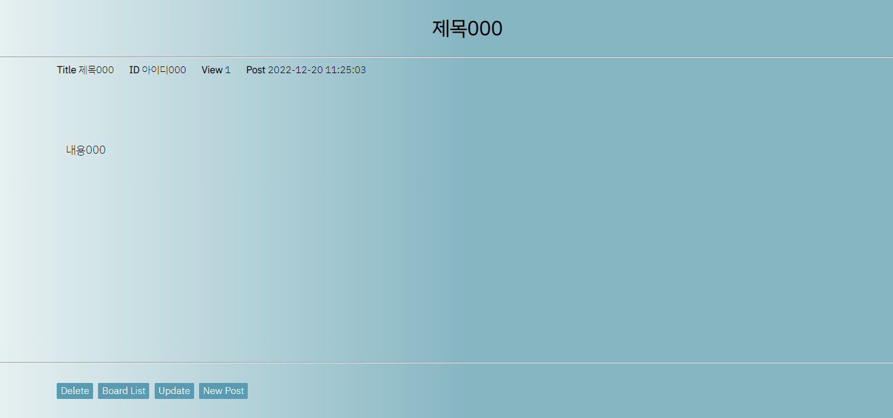
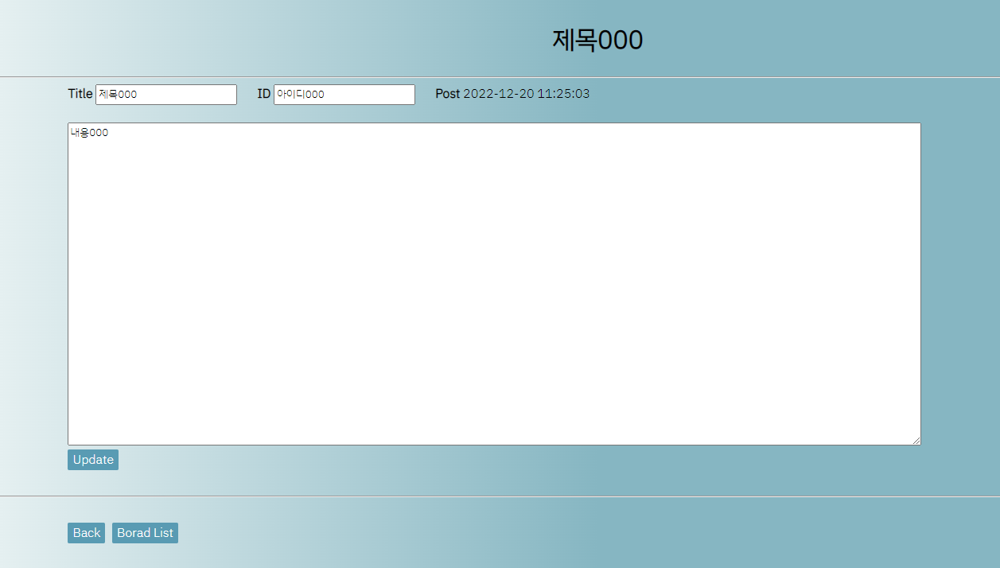
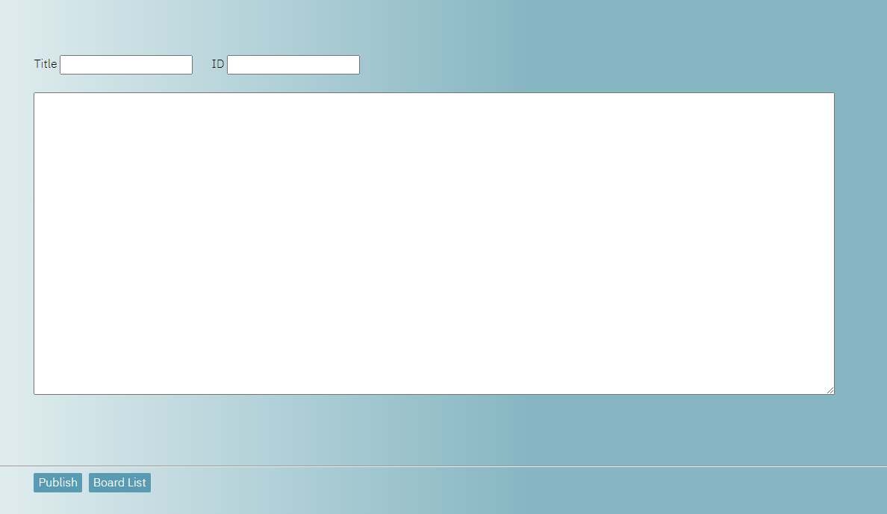

## Board site

#### 참고 : 

1. <https://happy-inside.tistory.com/category/%EC%BD%94%EB%94%A9/JSP%20%EA%B2%8C%EC%8B%9C%ED%8C%90>

2. <https://happy-inside.tistory.com/entry/JSP-JSP-%EA%B2%8C%EC%8B%9C%ED%8C%90-%EB%A7%8C%EB%93%A4%EA%B8%B0-1%EA%B0%95-%EC%A4%80%EB%B9%84>

#### 소스코드 :

<https://github.com/MJKim99/JSP_Board_Book>

## 기획의도

- 개발도구 : Java, mysql

- 화면 설계 및 구현 단계에서 만들었던 홈페이지를 참고하여 게시판과, 회원가입 로그인 기능을 구현했다.

- html을 jsp파일로 만들었고 mysql을 사용해 데이터베이스를 연결하여 게시판 글쓰기, 삭제, 수정, 회원가입, 로그인을 할 수 있도록 하였다.

## 이슈 

- jsp 파일로 바꾸는 과정에서 계속 코드의 오류가 생김.

- tomcat을 이용하여 서버를 연결하는데 문제가 생겨 웹서버에 연결되지 않음.

- 라이브러리에 문제로 임포트 되지 않는 파일들이 있어서 오류가 생김.

- mysql에서 데이터가 한글로 저장되지 않음.

## 해결책

- 톰캣의 문제는 처음엔 src/main/webabb/web-INF 내에 있던 jsp파일을 src/main/webabb로 옮겨 주어 해결함.

- 라이브러리의 문제는 파일의 빌드패스를 jdk의 버전과 맞게 바꿔줌.

- mysql의 문제 해결책 : 

	jsp 파일 내에 <%@ page language="java" contentType="text/html; charset=UTF-8" pageEncoding="UTF-8"%>,

	<% request.setCharacterEncoding("UTF-8"); %> 를 넣어준다.
	

## 개선사항

- 로그인했을때와 로그아웃 했을때의 화면에 나타나는 기능을 다르게 구현

 

## 추가하고 싶은 기능

- 게시판 글의 수가 10개 이상이 되면 페이지를 넘기는 기능

- 카테고리를 선택하여 글을 작성할 수 있게 하는 기능

- 글을 작성할 때 이미지 추가

- 댓글 

***

## 구현한 게시판

